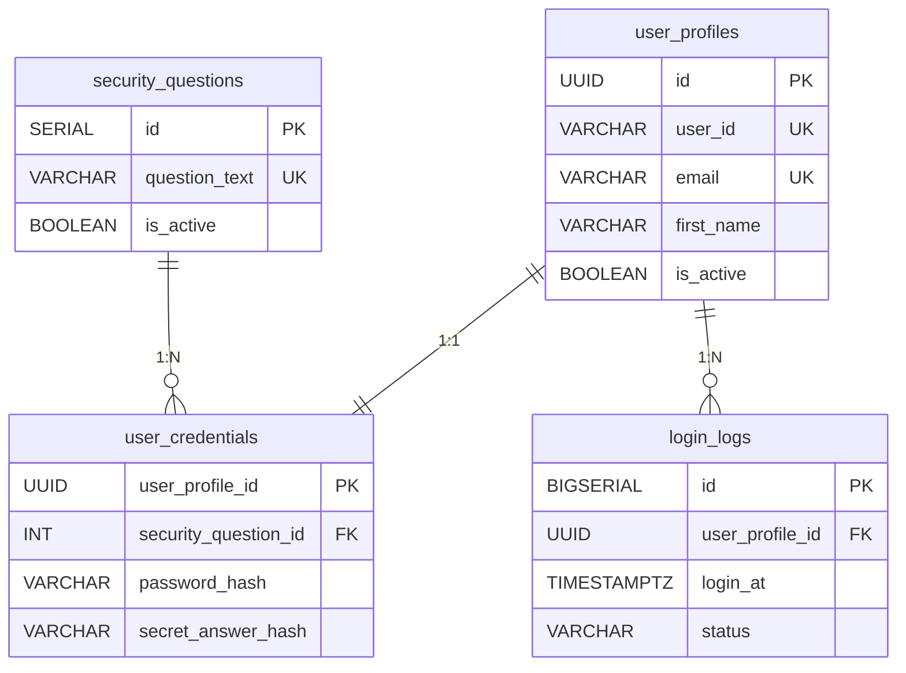
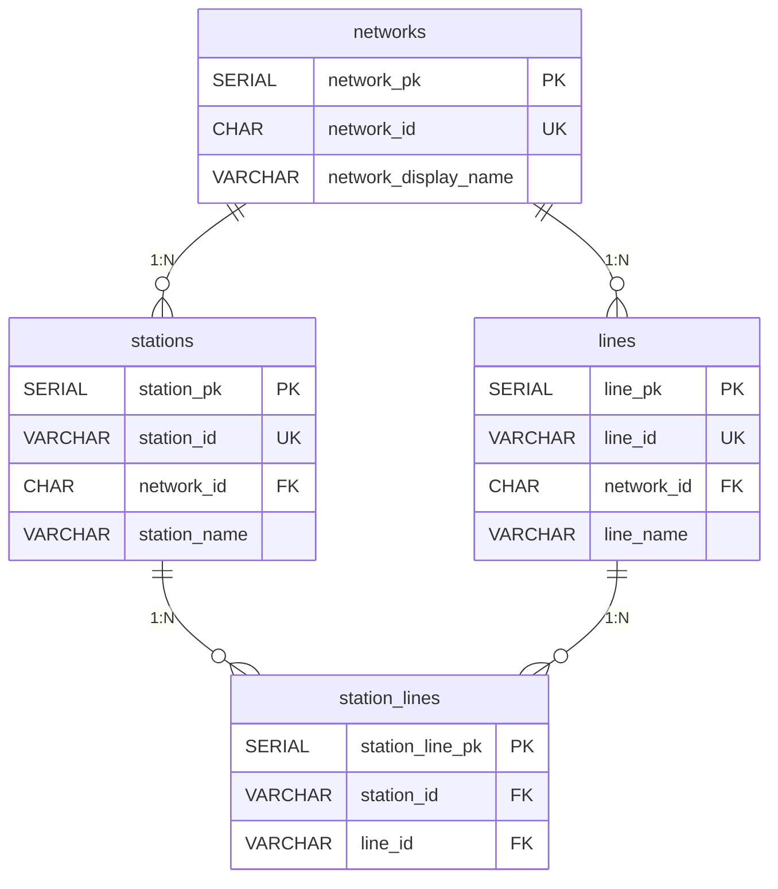
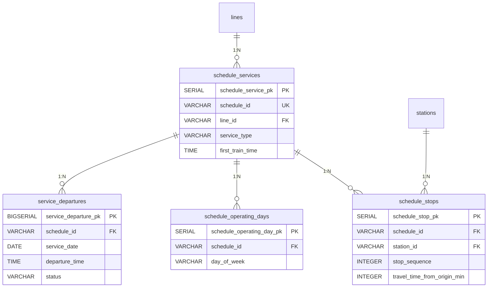
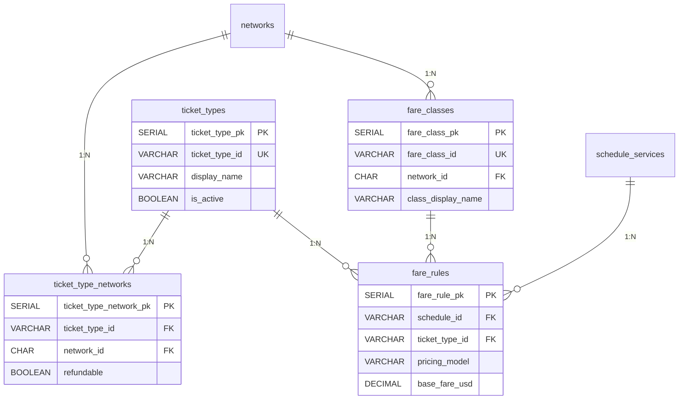
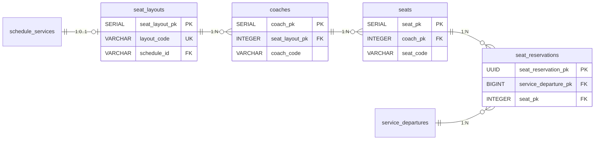
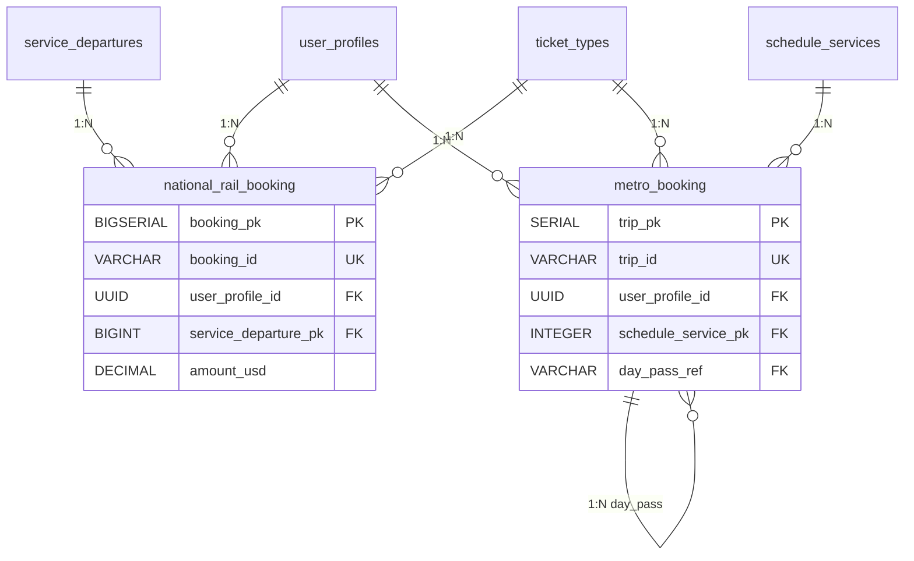
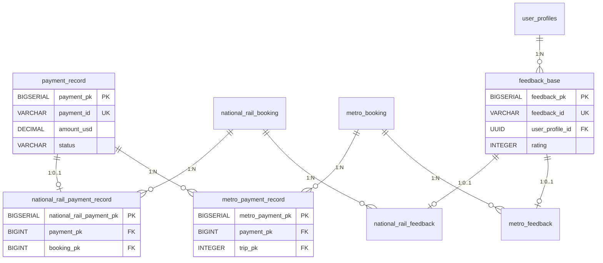
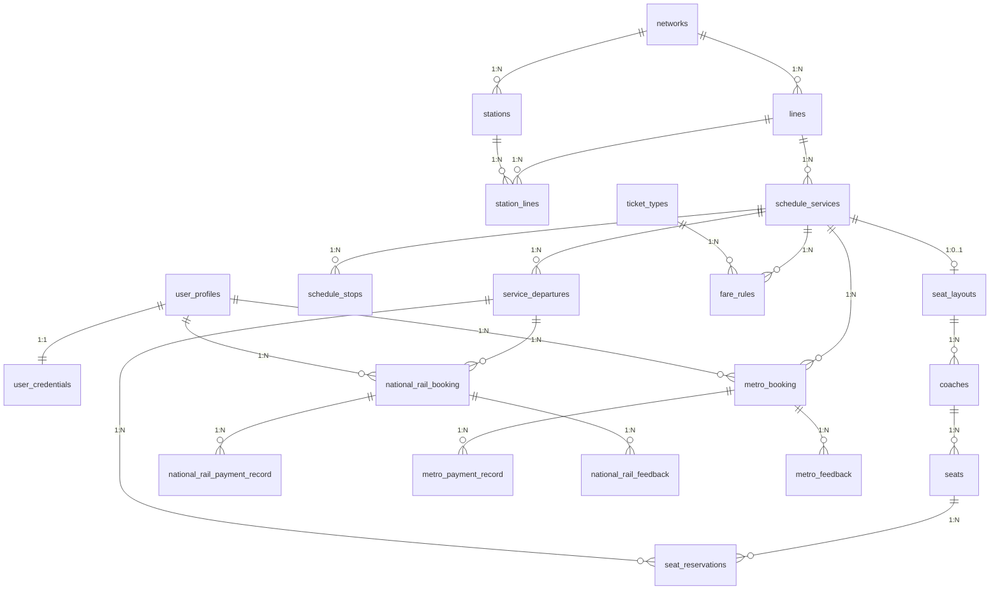

# Team01 資料庫設計文件

專案名稱：TransitFlow - Intelligent Rail Assistant  
組別：Team01

TransitFlow 是一個以鐵路助理為情境的資料庫整合專案。系統同時使用 PostgreSQL、Neo4j 與 pgvector：PostgreSQL 負責結構化交易資料，Neo4j 負責路網 traversal，pgvector 負責政策文件的語意檢索。這份文件說明我們如何把 mock data 拆成可維護的資料模型，以及這些設計如何支援查詢、訂票與 AI assistant 的回答。

## Section 1 — Entity-Relationship Diagram · /25

我們把 ERD 拆成幾個功能區塊閱讀。每張圖都保留主要 PK、FK 與代表欄位，完整欄位與 constraints 以 `databases/relational/schema.sql` 為準。最後的完整 ERD 總覽只呈現跨模組關係，方便看出整體資料流向。

### 使用者 ERD

使用者資料分成 profile、credential、安全問題與登入紀錄。這樣做的好處是把一般個人資料與敏感憑證分離，也讓登入紀錄可以用 append-only 的方式保留。



### 站點路線 ERD

`networks` 區分 metro 與 national rail。站點與路線是多對多關係，所以使用 `station_lines` 作為 junction table。這個設計避免只靠 `network_id` 推導站點屬於哪條線，因為同一個 network 內可能有多條線。



### 時刻 ERD

時刻表沒有把停靠站存在單一 JSON 欄位，而是拆成服務樣板、停靠站順序、營運日與實際班次。這讓系統可以清楚判斷某個 origin 是否在 destination 前面，也能針對特定日期與出發時間查詢座位。



### 票價 ERD

票價模型拆成票種、票種可用網路、艙等與票價規則。Metro 與 national rail 的計價方式不同，但都可以透過 `fare_rules` 表示：有些票價是 fixed price，有些票價是 base fare 加上 per-stop rate。



### 座位 ERD

座位資料只套用在需要指定座位的 national rail。`seat_layouts` 描述某個 schedule 使用哪一種座位配置，下面再分 coach 與 seat；實際預約則綁到 `service_departures`，也就是某一天某個出發時間的具體班次。這樣同一個 seat 可以在不同日期或不同 departure time 重複使用，但在同一班車中不能被重複保留。



### 購票與乘車紀錄 ERD

National rail 與 metro 的旅程資料分開存放。National rail 需要具體班次與座位；metro 比較接近乘車紀錄，也需要處理 day pass 讓後續旅程連回原始購買紀錄。



### 付款與回饋 ERD

付款與回饋用 base table 加 link table 表示。這樣可以讓 national rail booking 與 metro trip 共用付款、回饋的基本欄位，同時避免在同一張表放大量只適用於其中一種旅程的 nullable 欄位。



### 完整 ERD 總覽

這張總覽圖只保留主要跨模組關係。欄位細節放在前面的分區圖，這裡重點是呈現各模組如何互相連接。



## Section 2 — Normalisation Justification · /20

我們的 schema 優先把「會重複、會被多個功能共用、或具有獨立生命週期」的資料拆成獨立資料表。這樣雖然讓查詢需要更多 join，但資料比較不容易互相矛盾，也比較容易擴充。

最明顯的例子是時刻表。若把一個 schedule 的停靠站全部放在 JSON array 中，查詢「某班車是否先到 A 站再到 B 站」就需要解析 array；資料庫也很難檢查每個 stop 是否真的屬於該路線。現在的設計把 timetable header 放在 `schedule_services`，把停靠站順序放在 `schedule_stops`。其中一個重要的 functional dependency 是：

```text
(schedule_id, stop_sequence) -> station_id, travel_time_from_origin_min,
is_boarding_allowed, is_alighting_allowed, is_pass_through
```

也就是說，同一個 schedule 的第幾站，決定了它是哪個 station、離起站多久、是否可上下車。這讓 stop 相關欄位依賴於正確的候選鍵，而不是依賴於 schedule header 中的其他欄位，符合 3NF 的精神。

票價也採取類似想法。票種本身放在 `ticket_types`，票種適用網路放在 `ticket_type_networks`，艙等放在 `fare_classes`，實際價格公式放在 `fare_rules`。這樣 `single` 或 `day_pass` 的基本定義不會在每一筆價格中重複出現，也可以支援 metro 與 national rail 不同的價格模型。`fare_rules` 的核心 dependency 可理解為：

```text
(network_id, schedule_id, ticket_type_id, fare_class_id, effective_from)
    -> pricing_model, base_fare_usd, per_stop_rate_usd, price_usd, currency
```

使用者相關資料也刻意拆開。`user_profiles` 儲存姓名、email、電話等一般資訊；`user_credentials` 儲存 password hash、secret answer hash 與 hash algorithm；`security_questions` 是 lookup table；`login_logs` 是登入事件紀錄。這讓安全性資料不必和一般 profile 綁在一起，也避免安全問題文字在每個使用者身上重複儲存。

我們也有少量刻意的 denormalisation。`stations` 同時有 surrogate key `station_pk` 與可讀的 `station_id`。`station_pk` 適合 booking history 這種長期保存的 FK；`station_id` 則是使用者、mock data、agent tool 都會直接使用的代碼，例如 `MS01`、`NR05`。保留兩者讓資料庫內部穩定，應用層也容易閱讀。

另一個 trade-off 是 `schedule_services` 直接存 `origin_station_id` 與 `destination_station_id`。它們理論上可由 `schedule_stops` 第一站與最後一站推得，但起迄站是最常查詢與顯示的欄位，直接保存可以讓 timetable lookup 更直覺。為了降低不一致風險，schema 仍透過 FK 約束要求起迄站必須屬於該 line。

密碼與 secret answer 不以明文保存。seed script 使用 Argon2；runtime 註冊與登入則透過 Passlib 優先使用 `argon2`，並保留 `bcrypt`、`pbkdf2_sha256` 的相容性。Argon2 適合密碼儲存，是因為它不是單純快速雜湊，而是具備 key stretching 與可調整成本的 password hashing algorithm。MD5、SHA-1 速度太快，攻擊者可以大量暴力猜測；Argon2 則讓每次猜測更昂貴。Argon2 hash 也包含 salt，因此兩位使用者即使用相同密碼，資料庫中的 hash 也會不同，降低 rainbow table 攻擊的效果。

## Section 3 — Graph Database Design Rationale · /25

PostgreSQL 很適合處理時刻、票價、訂票與付款，因為這些資料需要明確 constraints 與交易一致性。但 route planning 的核心問題不是「查某幾列資料」，而是「沿著站點連線尋找一條路」。因此我們把實體路網放進 Neo4j。

Graph 中的 nodes 是站點：`:MetroStation` 表示 metro station，`:NationalRailStation` 表示 national rail station。每個 node 使用 `station_id` 作為 identity，例如 `MS01`、`NR05`。這比站名更穩定，也能和 PostgreSQL、mock data、agent tool 共用同一套代碼。

Relationships 表示站與站之間的可行移動：

- `:METRO_LINK`：相鄰 metro stations。
- `:RAIL_LINK`：相鄰 national rail stations。
- `:INTERCHANGE`：可轉乘的 metro 與 national rail stations。

`travel_time_min` 與 `line_id` 放在 relationship 上，因為它們描述的是「兩站之間的連線」，不是單一站點本身。這個設計讓 weighted path search 可以直接把 `travel_time_min` 作為成本。

對 shortest route 來說，Neo4j 可以直接用 Dijkstra-style traversal 找出總 travel time 最小的 path。若用 SQL，通常需要 recursive CTE，並在查詢中手動累加時間、保存已走過的 path、避免 cycle。這不是不可能，但語意上比 graph traversal 更繞，也更難維護。

我們目前支援的 graph query 包含：

- `query_shortest_route()`：用 travel time 找最快路徑。
- `query_interchange_path()`：允許跨 metro 與 national rail，並找出轉乘點。
- `query_alternative_routes()`：避開指定 station，適合用於施工或延誤情境。
- `query_delay_ripple()`：從延誤站點往外找 N hops 內可能受影響的站。

因此 graph database 的角色很明確：它不是替代 relational database，而是專門處理路網連通性與 path finding。

## Section 4 — Vector / RAG Design · /15

Vector/RAG 部分是課程框架已提供的設計，我們的重點是理解它如何幫助 assistant 回答政策與規則問題。TransitFlow 裡有些問題不適合用 SQL 精確查詢，例如「延誤 45 分鐘可以補償嗎？」或「day pass 有哪些限制？」這類問題需要從政策文字中找出語意相關段落，再交給 LLM 生成回答。

系統會把 `refund_policy.json`、`ticket_types.json`、`booking_rules.json`、`travel_policies.json` 中的內容轉成文字，透過目前設定的 embedding model 轉成 vector 後存入 PostgreSQL pgvector。使用者提問時，問題本身也會被轉成 query vector，接著用 cosine similarity 找出最接近的 policy 文件。

Cosine similarity 適合這個場景，因為它比較的是向量方向，而不是文字長度或向量大小。兩段文字即使長短不同，只要都在討論延誤補償，它們在 embedding space 中的方向應該會接近。系統再把最相關的文件片段放進 LLM context，讓回答有資料來源，而不是只靠模型記憶。

完整流程可以簡化成：

1. 使用者提出 policy 相關問題。
2. `llm.embed()` 產生 query embedding。
3. pgvector 依 cosine distance 找出 top-k relevant documents。
4. agent 把 retrieved documents 放入 prompt。
5. LLM 根據檢索內容產生自然語言回答。

在嵌入維度的選擇上，我們主要以 Ollama 的 `nomic-embed-text` 為主，因此文件向量採用 768 維。768 維對本專案的政策文件規模已經足夠，能在語意表達能力、儲存成本與本機執行速度之間取得平衡。Gemini embedding 則是 3072 維，語意容量更大，但也需要更大的 vector 欄位與索引空間。因為 pgvector 的欄位維度必須和 embedding model 輸出一致，所以若未來改用 Gemini，就不能直接沿用 Ollama 已建立的 768 維資料，而需要用 3072 維重新建立並重新 seed。

## Section 5 — AI Tool Usage Evidence · /10

### Example 1 — 關聯式 schema 設計

**Context:** 在設計票價、付款與退款相關欄位時，我們一開始想確認「金額直接用美金 `FLOAT` 存可不可以」，以及有沒有需要特別注意的地方。

**Prompt:**「在 PostgreSQL 的交通訂票系統裡，票價和付款金額直接用美金 `FLOAT` 存可以嗎？有沒有精度或計算上的問題？如果不建議用 `FLOAT`，可以怎麼設計？」

**Outcome:** AI 先提醒 `FLOAT` 可能出現 binary floating-point rounding error，不適合票價、付款與退款；它一開始建議可用 cent integer 儲存，例如把 8.50 美元存成 850 cents。這個方式精確，但我們覺得每次顯示與計算都要在 cents 和 USD 之間轉換，對本專案不夠直觀。後續 AI 改建議使用 `DECIMAL(10,2)`，我們也採用這個方案，並統一用 `_usd` 命名，例如 `amount_usd`、`base_fare_usd`、`per_stop_rate_usd`。

### Example 2 — Query implementation 與 agent 輸出格式

**Context:** Relational query 不只要 SQL 正確，也要回傳 agent 後續能使用的欄位。

**Prompt:**「請根據我們 normalised 的 `schedule_services` 和 `schedule_stops` tables 實作 `query_metro_schedules(origin_id, destination_id)`。它要找出兩站都有停靠且 origin 在 destination 前面的班表，並回傳 `stops_travelled` 和 ordered stop list，讓 agent 後續可以計算票價。」

**Outcome:** 最後查詢使用兩個 `schedule_stops` aliases 分別代表 origin 與 destination，並用 `origin_stop.stop_sequence < destination_stop.stop_sequence` 確認方向。完成後也檢查 `schedule_id`、`stops_travelled`、stop list 等欄位是否符合 agent 後續 fare calculation 的需求。

### Example 3 — Debugging 時修正錯誤方向

**Context:** 我們遇到兩種 debugging 情境。第一個是 schema 與 seed 後，pgAdmin 顯示的 table 數量比預期少；第二個是座位查詢原本沒有 `departure_time` 參數，導致只能查某天固定一班車。

**Prompt:**「請檢查 `schema.sql`，說明為什麼 table creation 會在建立完預期數量之前停止。先不要修改，先找出第一個真正的 DDL blocker。」以及「如果 `query_available_seats` 只有 `schedule_id` 和 `travel_date`，那 `make_booking` 固定訂當天第一班車代表什麼？是不是少了某個參數？」

**Outcome:** 第一個案例中，AI 協助把調查方向拉回 DDL，而不是繼續懷疑 seed script；真正原因是 `metro_booking` 曾出現重複 `trip_id` 宣告，導致 schema creation 停在該表附近。第二個案例中，AI 協助我們釐清：如果 seat availability 沒有 `departure_time`，那 `make_booking` 固定訂「當天第一班車」其實不是合理的使用者選擇，而是 function contract 缺少出發時間。後來我們把 `departure_time` 納入座位查詢與訂票流程，讓使用者可以指定同一天的不同班次。

### Example 4 — 座位可用性驗證

**Context:** `query_available_seats()` 必須排除同一具體班次中已被保留的座位，而不是只看某個 schedule 的座位配置。

**Prompt:**「請用實際 database 和 mock JSON 驗證 `query_available_seats`。確認在指定 schedule、日期、departure time 時，已被保留的座位不會出現在 available seats，並提供可以在 terminal 重跑的驗證指令。」

**Outcome:** AI 協助追蹤 `schedule_id -> service_departures -> seat_layouts -> coaches -> seats -> seat_reservations` 的資料路徑。最後查詢以 `service_departure_pk` 作為座位占用判斷基準，排除 `held`、`confirmed`、`completed` 狀態的 reservation。

### Example 5 — Graph rationale 撰寫

**Context:** 我們需要說明為什麼 route finding 使用 Neo4j，而不是把所有查詢都放在 SQL。

**Prompt:**「請說明 TransitFlow 的 graph database 設計：station nodes、metro/rail/interchange relationships、以及 weighted shortest-path queries。也請具體比較為什麼這類查詢用 Neo4j 會比用 recursive SQL 更自然。」

**Outcome:** AI 協助把實作轉成設計論述：station 是 nodes，連線是 relationships，`travel_time_min` 是 edge weight，而 shortest path、interchange path、delay ripple 都是 graph traversal 問題。

## Section 6 — Reflection & Trade-offs · /5

第一個重要取捨是 timetable normalisation。把 stops 拆成 `schedule_stops` 讓查詢比較需要 join，但它讓 stop order、travel time、boarding/alighting rules 都能被資料庫清楚表示，也讓 availability 與 fare calculation 更可靠。

第二個取捨是金額欄位使用 `DECIMAL(10,2)` 而不是 `FLOAT`。票價、付款、退款都需要精確到 cents；如果用 floating point，可能出現小數誤差，對交易系統來說不適合。

第三個取捨是 station 同時存在 PostgreSQL 與 Neo4j。這裡會有資料重複，但兩者目的不同：PostgreSQL 的 station 是 timetable、booking、fare 的 FK 基礎；Neo4j 的 station 是 route traversal 的 node。只要用同一個 `station_id` 對齊，我們認為這種重複是可以被接受的。
