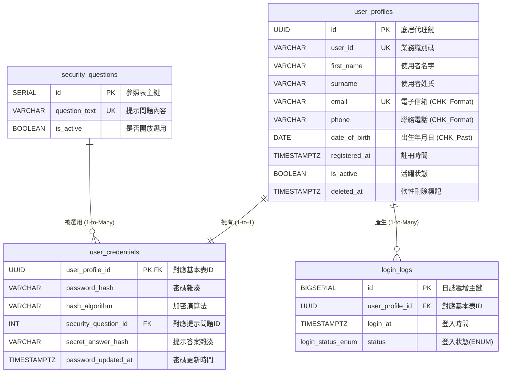
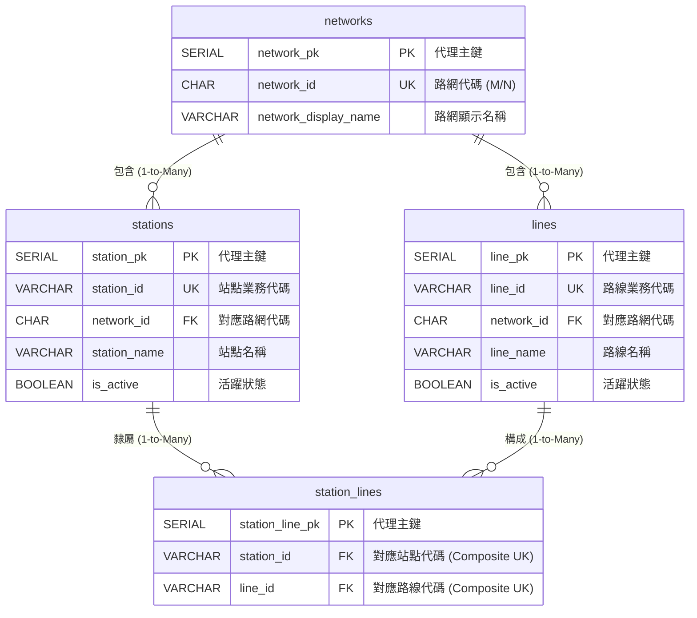
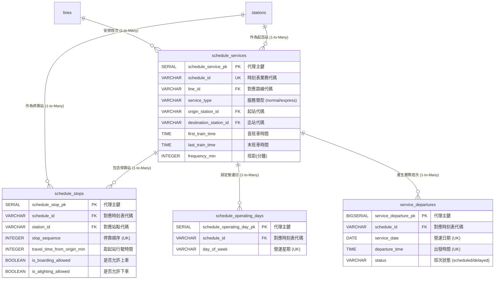
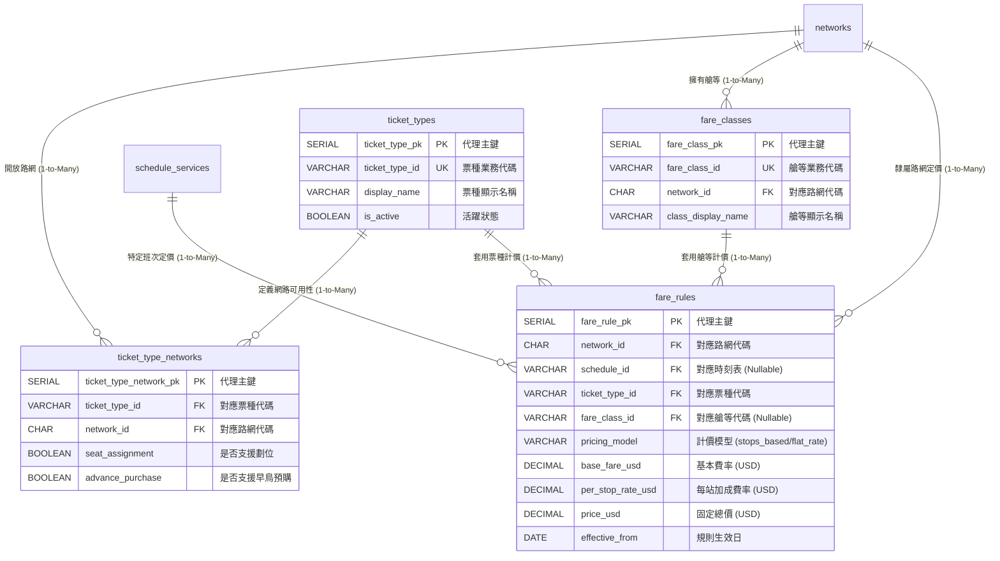
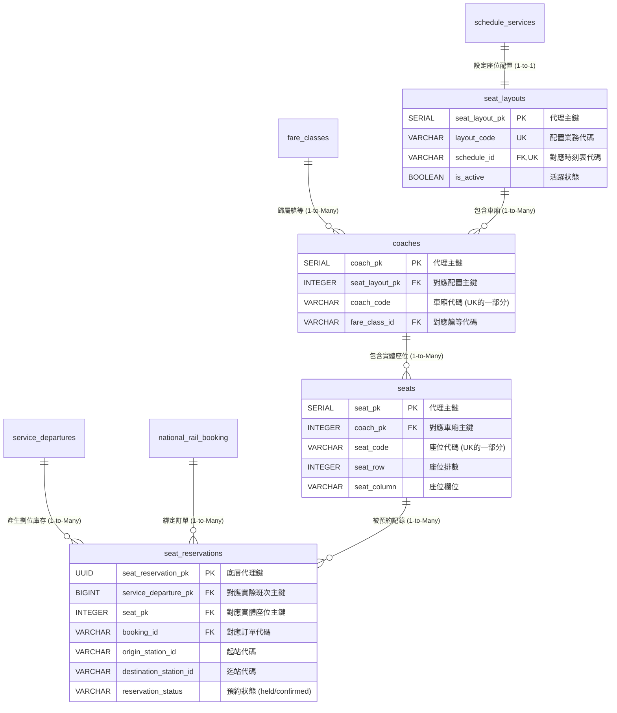
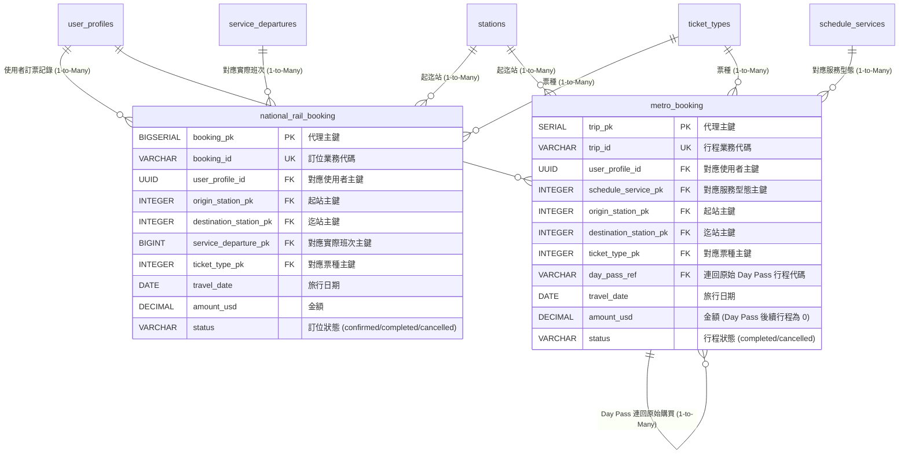
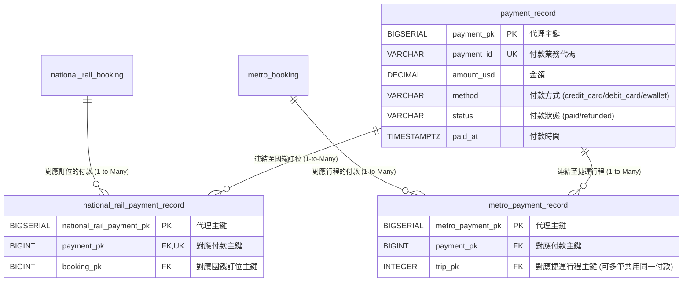
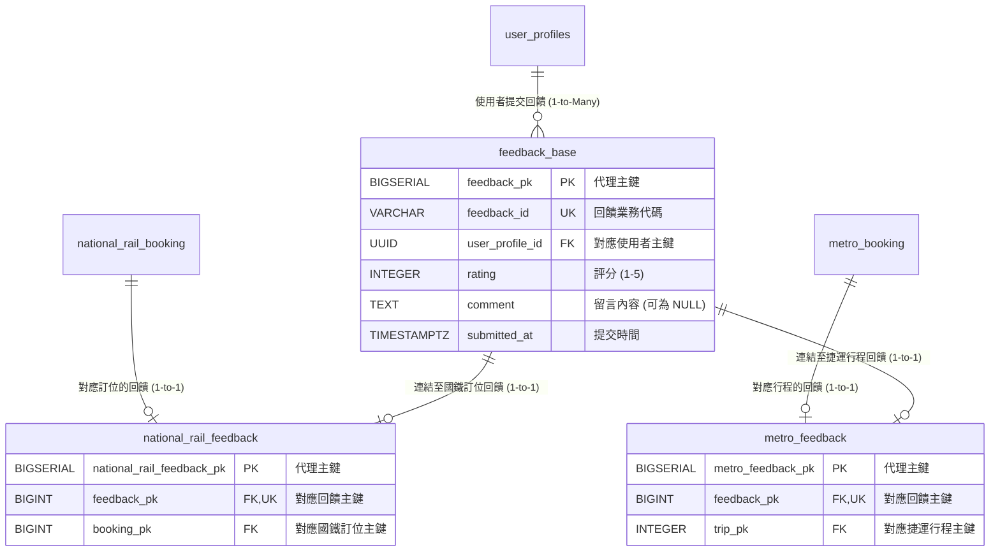
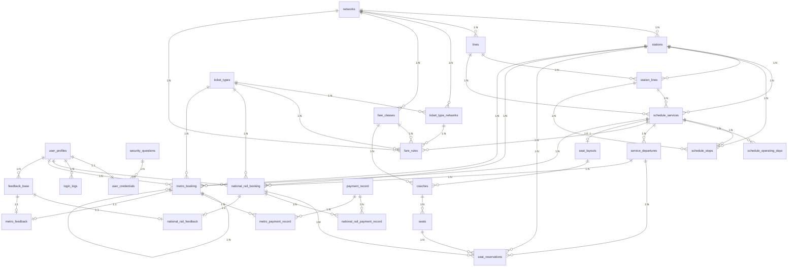
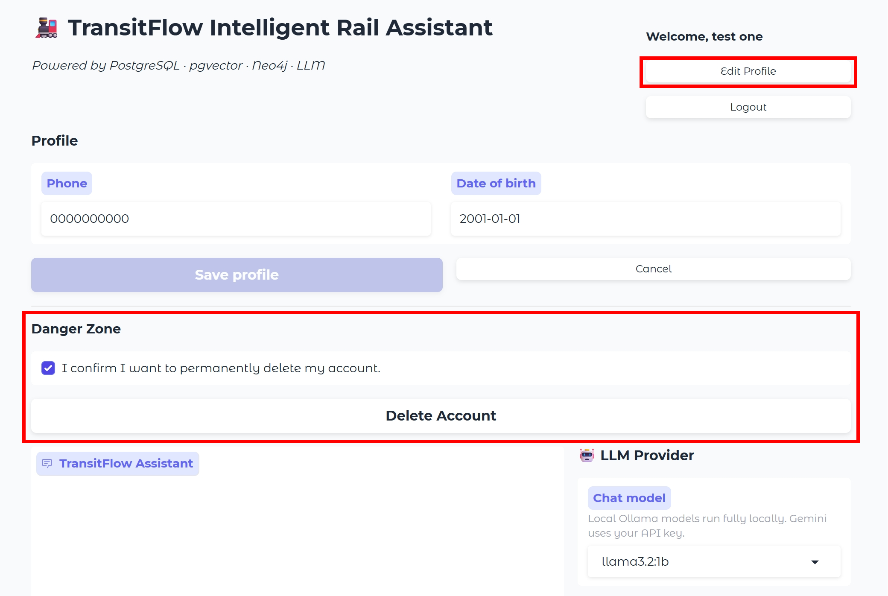

# Team01_DESIGN_DOC

# Team01 資料庫設計文件

專案名稱：TransitFlow - Intelligent Rail Assistant

組別：Team01

TransitFlow 是一個以鐵路助理為情境的資料庫整合專案。系統同時使用 PostgreSQL、Neo4j 與 pgvector：PostgreSQL 負責結構化交易資料，Neo4j 負責路網 traversal，pgvector 負責政策文件的語意檢索。這份文件說明我們如何把 mock data 拆成可維護的資料模型，以及這些設計如何支援查詢、訂票與 AI assistant 的回答。

## Section 1 — Entity-Relationship Diagram · /25

我們把 ERD 拆成幾個功能區塊閱讀。每張圖都保留主要 PK、FK 與代表欄位，完整欄位與 constraints 以 `databases/relational/schema.sql` 為準。最後的完整 ERD 總覽只呈現跨模組關係，方便看出整體資料流向。

### 使用者 ERD

**1. 系統實體與核心屬性概覽**

為滿足 TransitFlow 雙軌大眾運輸系統的 AI 助理身分驗證需求，使用者模組被高度正規化為四個核心實體，以確保資料安全性與營運彈性。

- **user_profiles (使用者基本資料)**：作為系統中代表使用者的核心實體。
    - **核心屬性**：使用 `id` (UUID) 作為底層系統關聯的主鍵 (PK) ，並具備對外業務識別碼 `user_id` (如 RU01) 。儲存 `first_name`、`surname`、`email` 等一般聯絡資訊。
    - **資料完整性**：透過 Check Constraints 嚴格限制 `email` 與 `phone` 格式，並確保 `date_of_birth` 必須為過去的日期。
- **user_credentials (使用者安全驗證)**：專責處理登入與資安防護的獨立實體。
    - **核心屬性**：使用 `user_profile_id` 作為主鍵兼外鍵 (PK/FK) 。儲存經過 Argon2id 演算法處理的 `password_hash` 與 `secret_answer_hash` 。
- **security_questions (安全提示問題參照表)**：集中管理的 Lookup Table，提升系統擴充性。
    - **核心屬性**：具備 `id` (SERIAL, PK) 與唯一的 `question_text` 。
- **login_logs (登入日誌)**：紀錄使用者存取軌跡的稽核實體。
    - **核心屬性**：使用 `id` (BIGSERIAL, PK) 以支援高頻率寫入。記錄 `login_at` 時間戳記與原生列舉型別 (Native ENUM) 的 `status` ('SUCCESS' 或 'FAILED')。

**2. 實體關聯與基數設計**

本系統模組包含三個主要的關聯設計，明確標示於 ERD 之中。

- **user_profiles (1) ─ (1) user_credentials**
    - **基數與業務邏輯**：嚴格的一對一 (1:1) 關聯。為了實踐「權限最小化」原則，一般個人資料與敏感憑證被物理性分離。當使用者帳號被刪除時，透過 `ON DELETE CASCADE` 確保敏感驗證金鑰被同步銷毀，避免孤兒資料 (Orphan records)。
- **user_profiles (1) ─ (N) login_logs**
    - **基數與業務邏輯**：一對多 (1:N) 關聯。採用 Append-only 的日誌設計模式 。避免在每次登入時對主表進行 UPDATE 操作而引發效能瓶頸，同時為 AI 助理判斷「連線 Session 狀態」提供完整的稽核軌跡。
- **security_questions (1) ─ (N) user_credentials**
    - **基數與業務邏輯**：一對多 (1:N) 關聯。多位使用者可選擇同一個預設的安全問題。此關聯特別設定為 `ON DELETE RESTRICT`，以防止系統管理員誤刪目前仍有使用者綁定的安全問題，保障使用者帳號恢復機制的穩定性。



### 站點路線 ERD

在站點與路線的架構設計中建了四個核心實體，最上層的 `networks` 實體定義了 Metro 與 National Rail 兩大路網系統。一個路網底下會包含多個站點 (`stations`) 與多條路線 (`lines`)，兩者與 `networks` 皆呈現 一對多 (1:N) 的從屬關聯。

為了解決真實世界中「一個站點可能有多條路線交會（即轉乘站）」以及「一條路線必定行經多個站點」的情境，站點與路線本質上為 多對多 (M:N) 關係。因此，我們設計`station_lines` 作為聯合資料表，將此 M:N 關係標準化拆解為兩個 1:N 關聯。

- **設計優勢：**系統不會僅依賴 `network_id` 來粗略推導站點歸屬，而是透過 `station_lines` 確保能精確對應同一路網內錯綜複雜的獨立路線與交會站點。此外，代理鍵（Surrogate Key，如 `station_pk`）與業務鍵（Business Key，如 `station_id`）的分離，能提升資料庫在面對業務代碼變更時的彈性與參照完整性。



### 時刻 ERD

在時刻表的架構設計中，我們不是將停靠站序列以單一 JSON 欄位儲存的反模式，而是採用高度正規化的關聯式設計。將時刻表拆解為四大核心實體：服務樣板 (`schedule_services`)、停靠站順序 (`schedule_stops`)、營運日 (`schedule_operating_days`) 與實際出發班次 (`service_departures`)。此模組以 `schedule_services` 作為核心中樞，與其餘三個維度的實體皆呈現 一對多 (1:N) 的關聯。

- **精確的行車方向與順序邏輯：** 透過獨立出 `schedule_stops` 實體並賦予 `stop_sequence` 屬性，系統在查詢時不再需要於應用層解析複雜的 JSON，而是能直接利用 SQL 語法，精確判斷乘客的起站 (Origin) 順序是否合法地早於迄站 (Destination)。
- **具象化的座位庫存與班次管理：** 將抽象的時刻表樣板實體化為 `service_departures`（實際班次），使系統能夠針對「特定日期」與「特定出發時間」建立獨立的營運狀態（如誤點、取消），為後續 National Rail 能精準鎖定並查詢實體座位庫存。



### 票價 ERD

在票價模型的架構設計中，我們建立具備高度彈性與整合性的計價引擎。模組分為四個核心實體：票種定義 (`ticket_types`)、票種可用網路 (`ticket_type_networks`)、艙等 (`fare_classes`) 以及票價規則 (`fare_rules`)。透過明確分離「票券規格」與「計價邏輯」，系統能精準應對不同路網的商業需求。

- **多型態計價規則：**設計亮點在於核心的 `fare_rules` 實體。雖然 Metro 與 National Rail 的計價方式不同，但我們統一透過 `pricing_model` 屬性來收斂邏輯。系統可依據該欄位，靈活決定採用「固定票價 (Fixed Price, `price_usd`)」（例如：捷運一日票），或是採用「基本費率加上每站加成 (Base Fare + Per-stop Rate)」（例如：台鐵對號座或捷運單程票），無需為不同路網拆分資料表。
- **精確的路網與票種約束：**透過 `ticket_type_networks` 聯合資料表，我們將票種與路網的 M:N 關係解耦，明確定義特定票種（如單程票、回數票）是否可通用於特定路網，並藉此管控提前購票 (`advance_purchase`) 或座位劃位 (`seat_assignment`) 等細部約束。
- **車廂等級分級定價：**結合 `fare_classes` 實體，系統能在同一種票種與班次下，依據標準廂或商務廂等不同艙等，衍生出對應的細部票價規則。



### 座位 ERD

座位資料只套用在需要指定座位的 national rail。`seat_layouts` 描述某個 schedule 使用哪一種座位配置，下面再分 coach 與 seat；實際預約則綁到 `service_departures`，也就是某一天某個出發時間的具體班次。這樣同一個 seat 可以在不同日期或不同 departure time 重複使用，但在同一班車中不能被重複保留。

針對需要指定座位的 National Rail 系統，我們採用「實體配置」與「營運庫存」分離的雙層架構。模組涵蓋了實體配置面的座位樣板 (`seat_layouts`)、車廂 (`coaches`)、實體座位 (`seats`)，以及動態狀態面的預約紀錄 (`seat_reservations`)。

- **階層化的座位模型：**座位配置採用由大至小的階層設計。`seat_layouts` 直接與時刻表服務樣板掛鉤，其下細分多個車廂 (`coaches`)，並可針對單一車廂綁定特定的艙等 (`fare_classes`)；而車廂內再進一步配置獨立的實體座位 (`seats`)。
- **時空解耦的預約機制：**這是本模組的設計核心。實體的座位紀錄 (`seats`) 並未直接綁定時間日期，實際的預約紀錄 (`seat_reservations`) 是將「靜態座位」與「特定日期的實際出發班次 (`service_departures`)」進行交集掛鉤。這種設計讓同一個物理座位能在不同日期或不同班次被無限次重複參照使用；同時，透過資料層級的關聯約束，嚴格確保在「同一個實際班車」中，該座位絕不會被重複保留。



### 購票與乘車紀錄 ERD

National Rail 與 Metro 的旅程資料分別存放在 `national_rail_booking` 與 `metro_booking` 兩張獨立的表中，原因如下：

- **業務鍵命名與語意不同**：National Rail 使用 `booking_id`／`booking_pk`，代表單次明確的訂位（具體班次與座位）；Metro 使用 `trip_id`／`trip_pk`，語意上更接近一筆「乘車紀錄」而非預先選定座位的訂位。兩者對應到不同的業務流程，若強行合併會讓 PK 命名與外部識別碼產生混淆。
- **欄位差異**：National Rail booking 需要 `service_departure_pk`（指向特定班次）；Metro booking 則需要 `schedule_service_pk`（指向服務型態）以及 `day_pass_ref`、`stops_travelled` 等 Metro 專屬欄位。若合併成單一表，會出現大量只適用於其中一種旅程類型的 nullable 欄位，違反正規化原則。
- **Day Pass 自我參照**：Metro 的 `day_pass_ref` 是對 `metro_booking(trip_id)` 的 self-referencing FK，讓當日後續的乘車紀錄可以連回原始購買 day pass 的那筆 `trip_id`（後續行程 `amount_usd = 0`）。這個關聯只存在於 Metro 內部，National Rail 沒有對應概念，因此也不適合放在共用表中。



### 付款 ERD

付款資料採用「base table + link table」模式：

- `payment_record` 為 base table，存放 National Rail 與 Metro 共用的付款基本欄位：`payment_pk`（PK）、`payment_id`（業務鍵）、`amount_usd`、`method`、`status`、`paid_at`。
- `national_rail_payment_record` 為 link table，將 `payment_record` 與 `national_rail_booking` 以 1:1 對應方式關聯起來（每張 booking 對應一筆付款記錄，但允許多次付款事件如付款/退款）。
- `metro_payment_record` 為 link table，將 `payment_record` 與 `metro_booking` 關聯。此表特別支援 **多筆 metro_booking 共用同一筆 payment_record** 的情境——例如使用者購買 day pass 時產生一筆付款，當日後續多筆 `trip_pk`（amount_usd = 0）皆透過各自的 link row 連回同一筆 `payment_pk`。

**為何採用此設計：**

若不拆分 base/link，National Rail 與 Metro 的付款各自需要的關聯鍵不同（`booking_pk` vs `trip_pk`），勢必在同一張付款表中放置兩組互斥的 nullable FK 欄位。拆成 base + link 後，共用欄位只存一份，兩種旅程類型各自的關聯邏輯（1:1 vs 1:N 共享付款）也能用各自的 link table 精確表達，避免大量無意義的 NULL。



### 回饋 ERD

回饋資料同樣採用「base table + link table」模式，結構與付款完全對應：

- `feedback_base` 為 base table，存放共用欄位：`feedback_pk`（PK）、`feedback_id`（業務鍵）、`user_profile_id`（FK 至 `user_profiles`）、`rating`、`comment`、`submitted_at`。
- `national_rail_feedback` 為 link table，將 `feedback_base` 與 `national_rail_booking` 以 **1:1** 方式關聯（`feedback_pk` 為 UNIQUE）。
- `metro_feedback` 為 link table，將 `feedback_base` 與 `metro_booking` 以 **1:1** 方式關聯（`feedback_pk` 為 UNIQUE）。

**為何採用此設計：**

回饋的核心欄位（評分、留言、提交時間、提交者）與旅程類型無關，因此抽出為 `feedback_base` 共用。每筆回饋只能對應到一種旅程類型的單一一筆 booking/trip，因此用兩張各自獨立的 1:1 link table 來區分「這是針對哪種旅程的回饋」，而不需要在 base table 中放置兩組互斥的 nullable FK（`booking_pk` 與 `trip_pk`）。



### 完整 ERD 總覽

這張總覽圖只保留主要跨模組關係。欄位細節放在前面的分區圖，這裡重點是呈現各模組如何互相連接。



## Section 2 — Normalisation Justification · /20

### 使用者

#### 1. 達到第三正規化的設計決策與功能相依性

在本系統的設計中，我們將「安全提示問題」從使用者資料中獨立出 `security_questions` 參照表 (Lookup Table)，這是一個標準的**第三正規化**決策。

- **功能相依性 (Functional Dependency) 分析**：
若將提示問題的明文直接記錄在使用者資料表中，會產生**遞移相依 (Transitive Dependency)**。具體而言，主鍵 `user_profile_id` 決定了 `security_question_id`，而 `security_question_id` 又決定了 `question_text`。這代表 `question_text` 是遞移相依於主鍵的。
- **解決的異常問題 (Anomalies)**：
透過拆分出 `security_questions` 表，我們消除了遞移相依，這解決了**更新異常 (Update Anomaly)** 的風險。若未來需要修正某個問題的錯字（例如將 "What is your mothers maiden name?" 加上一撇改為 "mother's"），我們只需在 `security_questions` 表中更新單一資料列，而不需要針對數千名選擇該問題的用戶執行龐大且危險的批次 UPDATE。

#### 2. 放棄反正規化 (De-normalisation)，堅持完全正規化的權衡考量

在設計登入狀態與歷史追蹤時，我們面臨了是否要採用**反正規化 (De-normalisation)** 的抉擇：將 `last_login_at` (最後登入時間) 作為一個屬性，直接合併回 `user_profiles` 表中。

- **拒絕反正規化的理由**：
雖然反正規化能減少 JOIN 操作，讓「查詢用戶最新狀態」的 SELECT 語法更簡單，但在本系統中，頻繁的登入行為會導致對 `user_profiles` 這張核心業務表產生大量且密集的 UPDATE 操作。這極易引發資料庫的橫列鎖定 (Row-level lock)，進而拖垮整體查詢效能。
- **完全正規化的優勢**：
我們將登入行為徹底抽離至獨立的 `login_logs` 表，採取 Append-only 的日誌寫入模式。這不僅免除了核心表的效能瓶頸，更保留了完整的資安稽核軌跡，在「寫入效能」與「架構簡潔度」的權衡中取得了最佳平衡。此外，在主鍵設計上，我們在底層使用 `id` (UUID) 作為主鍵，並保留 `user_id` 作為候選鍵供業務邏輯使用，強化了底層關聯的穩定性。

#### 3. 密碼雜湊策略：演算法選型與 Salt 防護機制

在處理 `user_credentials` 表中的敏感金鑰時，我們捨棄了 MD5 與 SHA-1 等傳統演算法，並選用 **Argon2id** 作為雜湊標準。

- **為何淘汰 MD5 / SHA-1？**
MD5 與 SHA-1 是設計用來快速驗證檔案完整性的訊息摘要演算法 (Message Digest)，其運算速度極快。攻擊者可以輕易利用 GPU 或 ASIC 礦機，每秒執行數十億次的暴力破解。
    
    相反地，**Argon2id** 是一種「記憶體與 CPU 消耗型」的演算法。它實作了金鑰延展 (Key Stretching) 與極高的成本因子 (Cost Factor)，刻意放慢雜湊的運算速度並大量佔用記憶體，使得駭客使用硬體加速器進行離線破解的經濟成本變高。
    
- **加鹽 (Salt) 如何抵禦彩虹表攻擊 (Rainbow-Table Attacks)**：
若不使用 Salt，兩位密碼同樣設定為 "alice1990" 的使用者，在資料庫中會產生完全相同的 Hash 值。駭客只需使用預先運算好的「彩虹表」進行反向查表，就能瞬間得知密碼明文。
為了解決這個問題，Argon2id 會在每次建立密碼時，自動生成一組隨機且唯一的密碼學字串——**鹽 (Salt)**，並將其與密碼結合後再進行雜湊（例如：`Hash("alice1990" + "隨機鹽")`）。這保證即使世界上有成千上萬名使用者使用相同的 "alice1990" 作為密碼，每一位使用者在資料庫中儲存的 `password_hash` 都會是獨一無二的亂碼，從根本上讓彩虹表失去作用。

### 站點路線與時刻表

在時刻表設計中，我們沒有將班次停靠站存成 Array 或 JSON 欄位，而是獨立拆解出 `schedule_stops` 關聯表。這樣的設計較符合正規化原則，也能避免將多值資料塞進單一欄位。

- **設計過程：** 首先，避免使用陣列欄位確保了資料具有單一屬性值，符合 1NF。接著，在 `schedule_stops` 中，我們將 `(schedule_id, stop_sequence)` 設為 Candidate Key，用來唯一識別某一時刻表中的第幾個停靠站。屬性如行駛時間 (`travel_time_from_origin_min`) 是依賴於該停靠紀錄，而不是儲存在時刻表主表中。最後，表中主要的非鍵值屬性並未依賴其他非鍵值屬性，因此降低了遞移相依的問題。需要注意的是，`line_id` 是為了支援複合外鍵約束、確保停靠站屬於同一路線而保留的欄位。這樣的設計讓系統能用標準的 SQL 語法，準確判斷起迄站的先後順序。

### 座位庫存

針對 National Rail 的座位系統，我們採用較正規化的設計，將靜態的實體座位 (`seats`) 與動態的預約紀錄 (`seat_reservations`) 明確拆開。

- **權衡理由：** 為了簡化查詢，我們大可選擇反正規化，直接在實際班次表 (`service_departures`) 中新增一個陣列欄位來記錄「已預約的座位代碼」。但這麼做在實際營運時會有極大的風險。在多人同時搶票的高併發情境下，多個交易若同時嘗試更新同一個陣列欄位，容易引發更新遺失等併發異常，進而導致座位超賣。透過將座位與預約紀錄拆分，我們能更容易利用資料庫原生的交易機制、資料列鎖定 (Row-level lock)，並搭配唯一約束或其他完整性限制來控管每一筆劃位，提升系統穩定性。

### 訂票與付款紀錄

付款紀錄設計遵循 **第三正規化**，主要目的是避免訂票資料與付款資料混合造成的資料重複與更新異常問題。

**解決的問題：**如果訂票與付款資訊被存放於同一張表（在某些設計中可能出現的情況），例如：

`booking (booking_pk, booking_id, user_id, amount_usd,
payment_id, payment_method, payment_status, payment_time)`

此設計會產生遞移相依。其中，`booking_pk` 可以直接決定訂票相關資訊，例如 `amount_usd`；然而，付款相關屬性則是透過 `payment_id` 間接決定：

- `booking_pk → amount_usd`
- `booking_pk → payment_id → payment_method, payment_status, payment_time`

由於 `payment_method`、`payment_status` 與 `payment_time` 實際上依賴的是 `payment_id`，而非直接依賴於 `booking_pk`，因此違反第三正規化的要求。

**解決方式：**為了解決此問題，我們將付款相關資訊拆分為獨立的 `payment_record` 實體，並透過 `national_rail_payment_record` 聯接表建立訂票與付款之間的關聯，使不同概念的資料能夠被分開管理。

在功能相依性分析中：

- `booking (booking_pk)` 決定 `{booking_id, user_id, amount_usd, trip_date}`，代表訂票本身的資訊。
- `payment_record (payment_pk)` 決定 `{payment_id, amount_usd, method, status, paid_at}`，代表付款交易資訊。
- `national_rail_payment_record (payment_pk, booking_pk)` 僅負責描述訂票與付款之間的關聯，不儲存額外非必要資訊。

透過此分解後，資料表皆符合第三規範式：

1. 所有欄位皆符合第一正規化，每個屬性皆具有原子性。
2. 所有非鍵值屬性皆完全依賴於主鍵，符合第二正規化。
3. 不存在非鍵值屬性依賴其他非鍵值屬性的情況，避免遞移相依，符合第三正規化。

### 訂票代理鍵 vs. 業務鍵之設計決策

在 `national_rail_booking` 的設計中，我們採用代理鍵（surrogate key）與業務鍵（business key）並存的方式，以區分系統內部識別與外部使用需求。

訂票資料同時需要一個適合資料庫內部關聯的識別方式，以及一個提供使用者與外部系統查詢的識別碼。因此將訂票識別拆分為兩個欄位：

`booking_pk` 採用 `BIGSERIAL` 作為系統內部使用的代理鍵，並設定為 `national_rail_booking` 的 primary key。該欄位由資料庫自動產生，主要用於資料表內部關聯與 foreign key reference，具有以下優點：

- **儲存效率較佳：** `BIGSERIAL` 使用整數型態，相較於字串型態的識別碼，能降低儲存成本並提升 join operation 的效率。
- **不可變性：** `booking_pk` 僅作為內部識別用途，不會因使用者需求或業務規則變更而修改，因此能避免相關資料需要 cascading update。
- **適合作為關聯鍵：** 整數型態的代理鍵更適合大量資料表之間的關聯性管理。

另一方面，`booking_id` 作為業務鍵，採用 `VARCHAR(20)` 並設定 `UNIQUE NOT NULL` 限制，提供給使用者與外部系統使用。其用途包含：

- **可讀性：** 例如 `BK-ZJI2CN` 相較於內部數字識別碼更容易被使用者理解。
- **外部參考用途：** API、客服查詢與使用者操作時，可使用此識別碼進行訂票查詢。

從功能相依性來看：

- `booking_pk → {booking_id, user_profile_id, origin_station_pk, destination_station_pk, travel_date, service_departure_pk, ticket_type_pk, amount_usd, status, booked_at, travelled_at}`
    
    表示每個 `booking_pk` 能唯一決定一筆完整的訂票資訊。
    
- `booking_id → {booking_pk, user_profile_id, origin_station_pk, destination_station_pk, travel_date, service_departure_pk, ticket_type_pk, amount_usd, status, booked_at, travelled_at}`
    
    由於 `booking_id` 具有 `UNIQUE NOT NULL` 約束，因此同樣可作為候選鍵（candidate key）。
    

雖然 `booking_pk` 與 `booking_id` 皆具有唯一識別能力，但我們選擇 `booking_pk` 作為 primary key，並保留 `booking_id` 的唯一性，以同時達成：

1. 高效的資料庫內部儲存與查詢。
2. 使用者友善的外部識別方式。
3. 穩定且不可變的內部資料關聯。

若未來 `booking_id` 的格式或展示需求改變，只需調整業務層識別規則，不需修改資料庫內部關聯結構。

相同設計模式亦應用於：

- `payment_record`：`payment_pk` 作為代理鍵，`payment_id` 作為業務鍵。
- `feedback_base`：`feedback_pk` 作為代理鍵，`feedback_id` 作為業務鍵。

## Section 3 — Graph Database Design Rationale · /25

## **資料模型設計：節點、關聯與屬性**

我們的圖形資料模型是專為呈現大眾運輸網路的拓樸結構而設計。節點、關聯與屬性的設計皆受路線規劃的實際需求所驅。

- **節點 (Nodes)：** 我們將 `MetroStation` 與 `NationalRailStation` 定義為節點。
    - **設計理由：** 車站代表了旅程起點、終點或中繼的實體位置，作為圖形網路遍歷的錨點。將它們拆分為不同的標籤，能讓查詢引擎在使用者要求「純捷運」或「純鐵路」旅程時，高效率地只掃描相關的子網路。
- **關聯 (Relationships)：** 我們使用具方向性的 `METRO_LINK`、`RAIL_LINK` 以及雙向的 `INTERCHANGE` 來連接節點。
    - **設計理由：** 關聯代表可通行的路徑。透過區分關聯類型，Cypher 遍歷引擎能夠輕鬆過濾特定子網路，例如尋找避開轉乘的路線。
- **屬性 (Properties)：** 節點屬性包含 `station_name`、`lines` 等，因為它們是車站本身的內在特徵，主要用於搜尋與過濾。關聯屬性則包含 `travel_time_min` 與 `line_id`，直接儲存在 `METRO_LINK` 與 `RAIL_LINK` 上。
    - **設計理由：** 將 `travel_time_min` 作為邊緣權重（Edge Weight）儲存，是執行權重路徑規劃演算法的先決條件。

## **節點識別 (Node Identity)**

在此圖形資料庫中，使用屬性 **`station_id`**（例如 `MS01`、`NR01`）來唯一識別節點。

Transitflow 專案是一個整合了關聯式資料庫 (PostgreSQL)、向量資料庫和圖形資料庫 (Neo4j) 的系統。使用 `station_id` (如 MS01, NR01) 作為**業務主鍵 (Business Key)**，可以確保在跨資料庫中都能使用同一個 ID 來精準對應到同一個車站。如果改用 Neo4j 的內部 ID，將無法把圖形資料庫的查詢結果，跟 PostgreSQL 中的詳細時刻表或票價資料做 JOIN 操作。

## **圖形模型支援的關鍵查詢情境**

- **權重最短路徑查詢 (`query_shortest_route`)：** 透過將資料結構化為 `(a)-[r:METRO_LINK]->(b)` 並儲存 `r.travel_time_min`，我們可以使用 Neo4j APOC 函式庫的路徑規劃演算法 `apoc.algo.dijkstra` 將 `travel_time_min` 作為權重，找出加總時間最小的「最快路線」，並非單純只看停靠站數 (hops)。
- **最少轉乘查詢 (`query_least_transfers_route`)：** 我們將轉乘明確建立為 `:INTERCHANGE` 關聯，Cypher 查詢可以配對起訖節點之間的路徑，並加總轉乘次數。我們嚴格過濾掉轉乘次數過多的路徑，並對 `:INTERCHANGE` 關聯施加 5 分鐘的人為時間懲罰，以將總行車時間計算出來，阻止演算法建議過度破碎的轉乘路線。

## **圖形與關聯式資料庫對比：演算法層面的優勢**

針對交通路線規劃，圖形資料庫在底層遍歷演算法的運作方式上較具優勢。

- **最短路徑計算 (Shortest Path Calculation)：**
    
    在關聯式資料庫中，要跨越多個未知數量的車站尋找路徑，資料庫必須執行迭代的資料表合併，這會導致中間結果集呈指數級膨脹，引發嚴重的記憶體消耗與極高的時間複雜度。要在 SQL 中計算「權重」最短路徑（最短行車時間），幾乎需要評估所有可能的排列組合才能進行排序。
    
    相反地，Neo4j 原生支援 **Dijkstra 演算法**。因為關聯與其權重 (`travel_time_min`) 被儲存為明確的記憶體指標（無索引相鄰，Index-Free Adjacency），Dijkstra 演算法可以使用優先佇列（Priority Queue）高效率地只探索最有可能的路徑，並以 $O(E + V \log V)$ 的時間複雜度解析出權重最短路徑，完全不需要迭代合併資料表。
    
- **延遲連鎖反應 (Delay Ripple)：**
    
    若要找出特定車站發生延遲時會波及哪些車站，圖形資料庫會使用**廣度優先搜尋 (BFS)** 從受影響的節點向外遍歷。由於無索引相鄰的特性，尋找相鄰車站時，每個跳躍（Hop）只需 $O(1)$ 複雜度的操作。
    
    若在關聯式資料庫中，連鎖反應的每一步都需要在關聯資料表（Junction Table）中進行多次索引尋找，當網路深度增加時，效能將會大幅衰退。
    

## Section 4 — Vector / RAG Design · /15

## 嵌入內容與餘弦相似度 (Embedded Content & Cosine Similarity)

**嵌入的內容：**
系統主要將「政策與規則文件」進行向量化嵌入（Embedding）。 `seed_vectors.py` 的實作，來源資料包含退票政策 (`refund_policy.json`)、票種定義 (`ticket_types.json`)、訂票規則 (`booking_rules.json`) 以及乘車規範 (`travel_policies.json`)。為了提高檢索精準度，我們採用了細粒度的文件分塊（Chunking）策略，例如將 `travel_policies` 拆分為單一子政策作為獨立的文件儲存，確保向量空間中的語意更加聚焦。

**為何使用餘弦相似度：**
餘弦相似度是**獨立於向量長度的（Magnitude-independent）**。它專門衡量兩個向量在**嵌入空間中的方向相似度（Directional similarity in the embedding space）**。這代表系統關注的是兩段文字在「語意主題」上是否指向同一個概念，而不會受到文件長度或特定關鍵字出現頻率的影響。這對於比對簡短的使用者問題（如："Can I bring my dog?"）與較長的政策條文（如："Pet Travel Policy Regulations..."）來說，是最為準確且合適的距離度量標準。

## 檢索增強生成完整流程 (The Full RAG Pipeline)

我們的 RAG (Retrieval-Augmented Generation) 架構由四個連續的階段組成，具體運作流程如下：

1. **問題向量化 (Query Embedding)：**
當使用者提出自然語言問題（例如："Can I get a refund for a delay?"）時，系統首先呼叫 LLM 供應商的 Embedding API，將這段文字轉換為高維度的浮點數陣列。
2. **相似度搜尋 (Similarity Search)：**
系統將產生出來的 Query Vector 傳送至 PostgreSQL (`pgvector`)。資料庫使用餘弦相似度運算子`<=>`，計算 Query Vector 與 `policy_documents` 資料表中所有預先嵌入的政策向量之間的距離，並依相似度分數進行排序。
3. **提取關聯文件 (Retrieved Documents)：**
資料庫回傳 Top-K（例如前 3 名）最相關的政策文件內容。這些文件即為使用者問題最有可能的標準答案來源。
4. **模型提示與生成 (LLM Prompt & Answer)：**
系統將這 Top-K 的原始文件內容與使用者的原始問題，一起注入到 LLM 的 System Prompt 中。Prompt 會嚴格指示 LLM 僅依據提供的參考文件來回答問題。最後，LLM 根據這些上下文合成出精準、自然的回答，從而消除模型幻覺。

## 向量維度選擇與供應商切換的後果

**維度選擇 (Embedding Dimension Choice)：**

在 TransitFlow 專案中，向量維度的大小並不是一個可以隨意選擇的參數，而是由我們選擇使用的 LLM 供應商及其對應的「嵌入模型 (Embedding Model)」決定的。

|  | **Ollama (預設選項)** | **Gemini (替代選項)** |
| --- | --- | --- |
| **嵌入模型** | `nomic-embed-text` | `gemini-embedding-001` |
| **向量維度** | **768** | **3072** |

不同的模型會將文字轉換成不同「長度」的數字列表。`nomic-embed-text` 模型產生的向量長度為 768，而 Gemini 的模型則為 3072。

**切換供應商的實際後果：**
如果在資料庫已經寫入資料之後切換了 LLM 供應商，將會發生**維度不匹配 (Dimension Mismatch)** 錯誤。即使修正資料庫欄位維度，由不同模型產生的向量也無法互相比較。

- **向量空間 (Vector Space)**：`nomic-embed-text` 的 768 維向量，與 Gemini 的 3072 維向量，是兩個完全不同的「次元空間」。
- **相似度計算**：向量相似度是透過計算兩個向量在**同一個空間中**的角度來判斷它們的意義有多接近。
- **實際影響**：如果用 Ollama 的模型將政策文件存入資料庫，然後用 Gemini 的模型來查詢使用者的問題，`pgvector` 會拋出錯誤並拒絕查詢。資料庫中原有的向量索引與資料將**完全無法使用**，導致 RAG 系統永遠找不到相關的文件，Agent 也只會回答「沒有相關資訊」。

## Section 5 — AI Tool Usage Evidence · /10

### Example 1 — **關聯式 schema 金額相關資料型態設計**

**Context:** 在專案初期設計票價與付款模組（如 `fare_rules`, `payment_record`）時，我們討論金額相關的資料欄位要以什麼型態儲存。原本打算直接使用 `FLOAT`，但不確定直接以浮點數處理小數運算是否會有潛在問題或風險，因此和 AI 討論。

**Prompt:** 「在設計 PostgreSQL 的交通訂票系統 Schema 時，票價和付款金額直接用美金 `FLOAT` 儲存可以嗎？會不會有什麼問題？如果不建議用 `FLOAT`，請以資料庫設計專家的角度提供務實建議」

**Outcome:** AI 回覆 `FLOAT` 會產生二進位浮點數精度誤差，強烈不建議用於財務數據。一開始 AI 建議使用 `INTEGER` 儲存「美分 (cents)」（例如將 $8.50 存為 850），但我們覺得這樣會導致前後端每次在顯示和計算時都需要進行匯率或單位的轉換，除了邏輯複雜度提高且不直觀外，也可能某個環節邏輯沒有寫好而導致金額異常的風險。
因此我們糾正了 AI 的方向，請它提供能直接儲存小數點且無精度問題的方案。AI 後來提到可以使用 `DECIMAL`，可以精確儲存需要小數點的數值，所以我們最終使用 `DECIMAL(10,2)`。

### Example 2 — **Debugging 時修正錯誤方向**

**Context:** 在系統整合測試階段，我們遇到一個需要 Debug 的情境。當時正在開發 National Rail 的劃位與訂票功能，測試時發現雖然同一天同一條路線可能有多個發車時間，但系統在建立訂單時似乎沒有正確區分不同班次，導致使用者無法自由選擇實際想搭乘的車次。

**Prompt:** 「關於 National Rail 的座位查詢功能，目前的 `query_available_seats` 只有傳入 `schedule_id` 和 `travel_date`。測試發現 `make_booking` 會固定去訂『當天第一班車』，是不是有漏參考到哪個欄位？」

**Outcome:** 針對這個問題，AI 協助我們定位出邏輯盲點：原本座位查詢只使用 `schedule_id` 和 `travel_date`，雖然可以知道是哪一條時刻表與哪一天，但無法唯一識別當天的哪一個實際發車班次。由於 `service_departures` 中同一個 `schedule_id` 在同一天可能對應多筆不同的 `departure_time`，如果沒有把 `departure_time` 納入查詢條件，訂票流程就容易預設抓到當天第一班車，造成旅客選擇的班次與實際建立的訂單不一致。

### Example 3 — Schema 欄位缺失的除錯

**Context:** 在系統整合初期執行完 `schema.sql` 後，透過 pgAdmin 檢查發現資料表總共應有 29 個，但實際只顯示 21 個。特別是與訂票、付款和回饋相關的表格都沒有被成功建立。我們嘗試重啟 Docker 容器，但問題仍未解決，懷疑 `schema.sql` 本身存在結構上的漏洞。

**Prompt:** 「資料表總共設計 29 個，但目前只有顯示 21 個，後段部分跟 booking、payment 有關的都沒有顯示，已嘗試重啟 docker 過了還是一樣。請檢查目前的 `schema.sql` 有無問題或漏洞。」

**Outcome:** AI 快速定位問題所在，發現 `metro_booking` 表中存在重複的欄位宣告，導致 SQL 語句在該表執行時產生錯誤，使得該表之後的所有資料表都無法被建立。具體而言，某個欄位被宣告了兩次，違反了 PostgreSQL 的語法規則。修正後重新執行 `schema.sql`，所有 29 個表格都成功建立。這個案例展示了 AI 在快速掃描複雜 SQL 指令碼時的優勢，能在眾多行程式碼中精準找出語法錯誤。

### Example 4 — 訂票流程中的參數遺漏問題

**Context:** 在開發座位查詢功能時，我們實作了查詢可用座位的函式，但在實際測試訂票時發現系統會固定訂「當天第一班車」，無法讓使用者選擇同一天的不同班次。初期懷疑是邏輯實現有誤，但仔細檢查後發現問題根本上在於缺少關鍵參數。

**Prompt:** 「關於 National Rail 的座位查詢功能，目前的查詢函式只有傳入 `schedule_id` 和 `travel_date`。測試發現訂票時會固定去訂『當天第一班車』，是不是有漏參考到哪個欄位？」

**Outcome:** AI 指出邏輯上的盲點：缺乏出發時間參數會導致座位查詢和訂票功能失去實用性，因為系統無法區分同一天內的不同班次。使用者即使想選擇下午的班車，系統也只能強制指派早晨的班次。因此我們將出發時間納入查詢函式和訂票函式的參數中，並相應更新 UI 層的參數傳遞邏輯。此修正使得系統能正確支持使用者指定特定班次的需求。

### Example 5 — 複雜業務邏輯：Metro Day-Pass 一個付款對應多個旅程

**Context:** 在設計地鐵系統的付款模型時，我們遇到一個不同於國鐵的複雜場景。地鐵提供「日票」(day-pass) 的服務：乘客購買一張日票可在同一天內搭乘無限次數，但系統需要追蹤每一次個別旅程。這意味著一筆付款記錄可能對應多個旅程記錄，而國鐵的一對一模型（一筆付款對應一張訂票）無法直接套用。我們需要決定如何在 schema 和應用邏輯中正確表現這個關係，既要支持多旅程共享付款記錄，又要防止資料異常。

**Prompt:** 「Metro 系統中，日票讓乘客在同一天內無限搭乘。一筆付款記錄會被多個旅程共享。在資料庫設計上，我們應該在 metro_payment_record 表中設定什麼約束，既允許一個付款記錄連接多個旅程，又要防止邏輯錯誤（比如同一個付款記錄被重複連接到同一個旅程）？此外，我們如何清楚標記『某個旅程屬於日票』？」

**Outcome:** AI 協助確認了一個精妙而安全的三層設計模式：

第一層，在 `metro_payment_record` 中設定 `UNIQUE (payment_pk, trip_pk)` 約束。這個約束的用意在於它防止「同一個付款記錄被重複連接到同一個旅程」，但並不禁止「同一個付款記錄連接到不同的多個旅程」。舉例：`payment_pk = 5001` 可以連接 `trip_pk = 100、101、102`（允許），但不能同時連接 `trip_pk = 100` 兩次（禁止）。

第二層，在 `metro_booking` 表中保留 `day_pass_ref` 欄位，用以標記「這個旅程屬於哪一張日票」。當乘客購買日票後的每一次搭乘，系統會建立新的 `metro_booking` 記錄，並將 `day_pass_ref` 指向原始日票旅程的 `trip_id`。這樣做的優點是讓應用層能快速查詢「某張日票已被使用了多少次」。

第三層，付款記錄本身保持不變性，一筆付款記錄代表一次付款事件，無論它被多少旅程共享，支付的金額、時間、方式都永遠不變。這確保了財務稽核的清晰性。

與國鐵的一對一付款模型不同，地鐵系統透過這個多層設計，既支持複雜的業務場景（無限搭乘），又保持了資料的一致性和可追蹤性。

## Section 6 — Reflection & Trade-offs · /5

- 原本部分資料表的 Primary Key 是以 `VARCHAR` 存放，例如 `station_id`、`schedule_id` 這類不會重複的字串。但後來看到老師於討論區的回覆後，我們了解到若直接使用 `VARCHAR` 作為資料庫內部 PK，雖然可讀性高、方便除錯，但在效能、維護性與安全性上可能會產生一些問題。因此，我們改以 UUID 或 `SERIAL` 作為資料庫內部 PK，並將原本 readable ID 保留為 `UNIQUE` business key。
    
    
    | PK 做法比較 | 優點 | 缺點 |
    | --- | --- | --- |
    | VARCHAR | ID 可讀性高，方便人工辨識與除錯；可直接對應 mock data 或外部系統代碼；查詢時不一定需要額外 join business key | 字串索引通常較大，可能影響查詢與 join 效能；ID 常需人工命名或由應用程式產生，容易有格式不一致或命名碰撞風險；若業務代碼未來改變，會牽動所有 FK；連續或有規則的字串 ID 可能被猜測 |
    | SERIAL | 由資料庫自動產生，簡單穩定；整數索引較小，join 效能通常較好；適合 station、line、schedule、ticket type 這類不敏感的主資料 | ID 本身沒有業務意義，仍需保留 readable business key；連續數字可能被推測資料量或資料順序；在分散式系統中需要額外處理 ID 產生問題 |
    | UUID | 由系統產生且幾乎不會碰撞；不連續、較難被猜測，適合使用者帳號、座位預約、訂單等 runtime 或敏感資料；較適合跨系統產生資料 | 長度較大，索引空間與 join 成本通常高於整數 PK；可讀性較差，不方便人工檢查；若大量隨機 UUID 寫入，可能造成索引維護成本較高 |
    
    基於上述比較，我們最後以 `SERIAL` 或 UUID 作為資料庫內部 PK，並把原本 readable ID 保留為 `UNIQUE` business key。這樣可以確保 PK 單一、穩定，且由資料庫或系統產生，減少人工命名碰撞與格式不一致的風險。對使用者帳號、座位預約這類較敏感或 runtime 建立的資料，我們使用 UUID，因為相較於連續字串 ID，UUID 更不容易被猜測。雖然這樣查詢時會多一層 business ID 與 surrogate key 的對應，有時需要額外 join 或 mapping。不過整體來說可以有更穩定的資料關聯、較低的維護風險，以及較好的資料安全性。
    

## **Section 7** — **Optional Extension Bonus ·  up to +15**

### Extension 1: 新增登入後的「修改個人資料」功能

#### **Motivation**

本次延伸功能新增登入後的「修改個人資料」流程。原本 TransitFlow 已支援登入、註冊、查詢班次、票價與訂票，但登入後使用者無法直接查看或更新自己的聯絡資訊。這會讓帳戶管理流程不完整：使用者若電話或出生日期資料錯誤，只能依賴後台資料庫修改，而不能透過系統 UI 自行維護。

此功能讓使用者在 UI 畫面中點選 `Edit Profile`，查看目前儲存在 PostgreSQL 的 `phone` 與 `date_of_birth`，修改任一欄位後按下 `Save profile` 儲存。儲存成功後，Profile panel 會自動收起，讓流程更接近一般帳戶設定頁。也就是新增一個實際 account-management interaction，並透過新的 database operation 更新 `user_profiles` table。

#### **Database Changes**

這個 extension 沒有新增新的 table，`phone` 與 `date_of_birth` 是使用者 profile 所需的基本欄位，但有針對 profile 資料加入 `CHECK` constraints，確保從 UI 或 query 寫入的資料在 database layer 也能被驗證。

```sql
CREATE TABLE user_profiles (
    id UUID PRIMARY KEY DEFAULT gen_random_uuid(),
    user_id VARCHAR(50) UNIQUE NOT NULL,
    first_name VARCHAR(50) NOT NULL,
    surname VARCHAR(50) NOT NULL,
    email VARCHAR(255) UNIQUE NOT NULL,
    phone VARCHAR(50) NOT NULL,
    date_of_birth DATE NOT NULL,
    registered_at TIMESTAMPTZ NOT NULL DEFAULT NOW(),
    is_active BOOLEAN NOT NULL DEFAULT TRUE,
    deleted_at TIMESTAMPTZ,

    -- TASK 6 EXTENSION: Keep account lookup data reliable by rejecting invalid email formats at the database layer.
    CONSTRAINT chk_email_format CHECK (email ~* '^[A-Za-z0-9._+%-]+@[A-Za-z0-9.-]+\.[A-Za-z]+$'),

    -- TASK 6 EXTENSION: Keep UI profile updates consistent with valid phone input before accepting writes.
    CONSTRAINT chk_phone_format CHECK (phone ~ '^[0-9\+\-\(\)\s]{7,20}$'),

    -- TASK 6 EXTENSION: Prevent impossible profile data such as future dates of birth.
    CONSTRAINT chk_dob_past CHECK (date_of_birth <= CURRENT_DATE)
);
```

這個 extension 也新增 database operation：

```python
update_user_profile(user_email, phone, date_of_birth)
```

此 function 會用目前登入者的 email 找到 `user_profiles` row，只允許更新 `phone` 與 `date_of_birth`。更新前會先在 Python 層檢查電話格式、日期格式與未來日期，讓 UI 能顯示清楚錯誤訊息；寫入時再由 PostgreSQL constraints 作最後防線。function 也使用 `SELECT ... FOR UPDATE` 鎖定該使用者 profile row，避免同一使用者同時儲存時發生覆蓋。

#### **Example Queries**

查看 seeded user 目前的 profile 資料：

```sql
SELECT user_id, email, phone, date_of_birth
FROM user_profiles
WHERE email = 'alice.tan@email.com'
  AND deleted_at IS NULL;
```

Expected output:

```
user_id | email               | phone       | date_of_birth
RU01    | alice.tan@email.com | 07912340101 | 1990-03-14
```

更新使用者電話與出生日期：

```sql
UPDATE user_profiles
SET phone = '07999998888',
    date_of_birth = '1990-03-14'
WHERE email = 'alice.tan@email.com'
  AND deleted_at IS NULL
RETURNING user_id, email, phone, date_of_birth;
```

Expected output:

```
user_id | email               | phone       | date_of_birth
RU01    | alice.tan@email.com | 07999998888 | 1990-03-14
```

測試 `chk_dob_past` constraint：未來出生日期應被拒絕。

```sql
UPDATE user_profiles
SET date_of_birth = CURRENT_DATE + INTERVAL '1 day'
WHERE email = 'alice.tan@email.com';
```

Expected result:

```
ERROR: new row for relation "user_profiles" violates check constraint "chk_dob_past"
```

#### Testing Evidence

程式檢查：

```bash
python -B -m py_compile skeleton/ui.py databases/relational/queries.py
git diff --check -- skeleton/ui.py databases/relational/queries.py
```

Profile 讀取測試曾確認 seeded user `alice.tan@email.com` 的 profile 可由 PostgreSQL 正確讀出：

```
{'user_id': 'RU01', 'email': 'alice.tan@email.com', 'phone': '07912340101', 'date_of_birth': '1990-03-14'}
```

No-change update path 也已測試。當送出的電話與出生日期和資料庫目前值相同時，`update_user_profile()` 不會執行不必要的資料更新，並回傳：

```
True False
07912340101 1990-03-14
```

UI 行為測試包含：

- 登入後會顯示 `Edit Profile` 按鈕。
- 點擊 `Edit Profile` 後會載入目前使用者的 `phone` 與 `date_of_birth`。
- 修改任一欄位後，`Save profile` 會啟用。
- 儲存成功後，資料會寫回 PostgreSQL。
- 儲存成功後，Profile panel 會自動收起。
- 錯誤電話格式、錯誤日期格式與未來出生日期都會被拒絕。
- 原本 login、register、forgot password、chat flow 不受影響。

#### Code Location

Task 6 code inventory 已整理於 repo root 的 `TASK6.md`。相關檔案如下：

```
TASK6.md
databases/relational/schema.sql
databases/relational/queries.py
skeleton/ui.py
```

主要 table、constraints 與 functions：

```
Table: user_profiles
Constraints: chk_email_format, chk_phone_format, chk_dob_past
Database function: update_user_profile()
UI functions: open_profile_panel(), on_profile_change(), save_profile()
```

### Extension 2: 實作立即刪除與憑證匿名化邏輯

#### **Motivation**

為符合資料保護與隱私權規範，當使用者要求刪除帳號時，單純隱藏帳號或標記為未啟用並不足夠。必須實作機制以立即銷毀敏感憑證（如密碼與安全提問解答），並將能識別個人的資料 (PII) 徹底匿名化，確保資料無法被還原或未經授權存取。此外，前端需要整合明顯且安全的刪除入口與雙重確認機制，避免使用者誤觸造成資料遺失。

#### **Database Changes**

在資料庫查詢層（`databases/relational/queries.py`）新增了刪除帳號專用的 Database Operation：

```python
delete_user_account(email: str) -> bool
```

這個函式利用資料庫 Transaction 來保證以下兩個更新動作同時成功：

1. 更新 `user_profiles`：將該帳號的 `deleted_at` 設為 `NOW()`，`is_active` 設為 `False`。同時將 `user_id`、`email`、`first_name`、`surname`、`phone`、`date_of_birth` 欄位完全匿名化（例如將 `user_id` 替換為含有隨機 UUID 的 `deleted_UUID`，`email` 替換為 `deleted_UUID@example.com`）。
2. 更新 `user_credentials`：將 `password_hash` 與 `secret_answer_hash` 以 `DELETED_...` 等隨機或無效字串覆寫，並更新 `password_updated_at = NOW()`。

#### **Example Queries**

在資料庫底層，當使用者觸發刪除操作時，等同於在單一 Transaction 中執行以下指令：

```sql
BEGIN;

-- 1. 匿名化使用者 Profile，並標記為已刪除與未啟用
UPDATE user_profiles
SET
    user_id = 'deleted_' || gen_random_uuid()::text,
    email = 'deleted_' || gen_random_uuid()::text || '@example.com',
    first_name = 'Deleted',
    surname = 'User',
    phone = '00000000000',
    date_of_birth = '1900-01-01',
    is_active = FALSE,
    deleted_at = NOW()
WHERE email = 'alice.tan@email.com' AND deleted_at IS NULL
RETURNING user_id;

-- 2. 針對前一步驟取回的 user_id，徹底銷毀其憑證
UPDATE user_credentials
SET
    password_hash = 'DELETED_' || gen_random_uuid()::text,
    secret_answer_hash = 'DELETED_' || gen_random_uuid()::text,
    password_updated_at = NOW()
WHERE user_id = '<returned_user_id>';

COMMIT;
```

#### **Testing Evidence**



#### **Code Location**

相關檔案與函式異動如下：

```
databases/relational/queries.py
skeleton/ui.py
```

主要 functions：

```
Database function: delete_user_account()
UI integration: 在 Profile 畫面中新增 Delete 按鈕，與刪除前的安全防呆確認流程
```